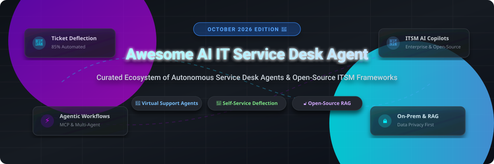

# Awesome-AI-IT-Service-Desk-Agent

# Awesome-AI-IT-Service-Desk-Agent 🎫 🤖

  

  

  

  

  

  

  

---

## 🌟 Top AI IT Service Desk Agent Ecosystem

**Curated List of Commercial ITSM AI Platforms & Open-Source Service Desk Automation Frameworks**  

*Focused on Autonomous Ticket Resolution, Virtual Agents, Self-Service Deflection, Agent Copilots, Knowledge-Grounded Answers & Self-Hosted ITSM Automation*

**Last updated: October 2026** 📅

---

### 📌 Overview & SEO Summary

Welcome to the ultimate curated directory of **AI IT service desk agents**, **open-source ITSM automation frameworks**, and **enterprise virtual support tools**. Whether you are looking for enterprise-grade commercial solutions (such as *Salesforce Casey*, *Moveworks*, and *ServiceNow Virtual Agent*), or self-hostable open-source alternatives (like *Bytedesk*, *MCP ITSM*, and *AI Service Desk ADK*), this list covers category leaders, knowledge-grounded resolution, and privacy-respecting service desk automation.

**Key Market Context:**

- **Salesforce Casey the Help Agent** resolves **85% of Salesforce's own customer service requests**, deploying across voice, web, portals, SMS, and WhatsApp with **pay-per-resolution pricing at €2 per resolution** .

- **Moveworks** was acquired by ServiceNow, fundamentally changing the vendor landscape for existing customers .

- **Enterprise platforms like ServiceNow and Moveworks routinely land north of $100,000/year**, while per-agent ITSM tools like Freshservice run **$19 to $99 per agent per month** .

- **Rezolve.ai and Leena.ai** are seeing **30-40% ticket deflection rates** when deployed on top of ServiceNow and Freshdesk .

- **Freshservice Freddy AI** is three products, not one: autonomous self-service agent (Enterprise), agent copilot (US$29 add-on on Pro), and predictive insights — **every capability inherits the quality of your knowledge base** .

---

## 📑 Table of Contents

- [🏢 SaaS & Commercial Platforms](#-saas--commercial-platforms)

- [🔓 Open-Source GitHub Projects](#-open-source-github-projects)

- [🛠️ How to Contribute](#%EF%B8%8F-how-to-contribute)

- [📊 Star History](#-star-history)

- [🤝 Support & Sponsorship](#-support--sponsorship)

- [⚠️ Disclaimer](#%EF%B8%8F-disclaimer)

---

## 🏢 SaaS / Commercial Platforms

The AI IT service desk agent market spans **CRM-integrated autonomous agents** (Salesforce Casey) that resolve issues **start-to-finish across every channel with pay-per-resolution pricing**, **enterprise employee support platforms** (Moveworks, Aisera) that **automate IT, HR, and finance requests**, and **ITSM-native AI copilots** (ServiceNow Virtual Agent, Freshservice Freddy) that **augment existing helpdesk platforms**. **Salesforce Casey** charges **€2 per resolution** with **unmetered Agentforce actions** . **Freshservice Freddy AI Copilot** costs **~US$29/agent/month add-on on Pro**, with **Enterprise adding AU$15,000–$25,000/year** . **Moveworks** pricing is **quote-only and routinely lands north of $100,000/year** . **Rezolve.ai and Leena.ai** achieve **30-40% ticket deflection** .

| SaaS / Commercial Platform | Company / Owner | Valuation / Market Cap | Standard Edition Starting Price | Free Tier / Free Trial Limits | Description |

| :--- | :--- | :--- | :--- | :--- | :--- |

| **[Salesforce Casey the Help Agent](https://www.salesforce.com/service/ai/)** ☁️ | Salesforce | ~$250 Billion | **€2 per resolution** | **No free tier**; demo required | **Autonomous service agent** — **Deploys across voice, web, portals, SMS, and WhatsApp** . **Independently triggers complex workflows** like scheduling and order management . **Seamless escalation with full customer context** . **85% of Salesforce's own customer service requests resolved** . **Unmetered Agentforce actions per resolution** . |

| **[ServiceNow Virtual Agent](https://www.servicenow.com/)** 🟢 | ServiceNow | ~$150 Billion | **Custom enterprise pricing** (quote-only) | **No free tier**; demo required | **ITSM-native virtual agent** — **24/7 support resolving routine queries instantly** . **Now Assist for ITSM** available as quote-only add-on . **Enterprise-scale agentic AI** with **Autonomous Workforce** capabilities . |

| **[Moveworks](https://www.moveworks.com/)** 🔵 | ServiceNow (Acquired) | ~$150 Billion (ServiceNow) | **Quote-only; routinely >$100,000/year**  | **No free tier**; custom quote required | **Employee support automation** — **AI assistant providing instant IT support through chat** . **Acquired by ServiceNow** — the relationship being bought is now ServiceNow . **Resolves helpdesk requests autonomously** . |

| **[Aisera](https://aisera.com/)** 🎯 | Aisera | Private | **Quote-only**  | **No free tier**; demo required | **Enterprise service desk AI** — **Automates ticket resolution and user assistance across IT, HR, finance, legal, and facilities** . **Quote-only pricing** with enterprise-scale deployment . |

| **[Espressive Barista](https://www.espressive.com/)** 🟣 | Espressive | Private | **Custom enterprise pricing** | **Demo available** | **Conversational virtual agent** — **Immediate, personalized assistance across departments** . **BaristaGPT supports 130+ languages** . **Integrates with existing enterprise systems** . |

| **[Freshservice Freddy AI](https://www.freshworks.com/freshdesk/freddy-ai/)** 🔴 | Freshworks | ~$3 Billion | **US$29/agent/month** (Copilot add-on on Pro)  | **Freddy AI Agent included on Enterprise plans** | **ITSM-native AI suite** — **Three products**: autonomous self-service agent, agent copilot, and predictive insights . **Triage, response drafting, and ticket summarisation work from go-live** . **Self-service deflection requires accurate knowledge base** . |

| **[Leena AI](https://leena.ai/)** 💛 | Leena AI | Private | **Custom enterprise pricing** | **Demo available** | **AI colleagues for employee support** — **Proactive digital workers executing end-to-end processes across applications including voice** . **"AI colleagues don't wait for instructions, they get up at seven in the morning and start working"** . **Transparency Dashboard logs every agent action** . **10.6% AI voice share** . |

| **[Rezolve.ai](https://rezolve.ai/)** 🔄 | Rezolve.ai | Private | **Custom enterprise pricing** | **Demo available** | **Generative AI virtual agents** — **Plugs into ServiceNow and Freshdesk for IT and HR support** . **30-40% ticket deflection rates** with improved employee satisfaction . **10.6% AI voice share** . |

| **[Amelia](https://www.amelia.com/)** 👩‍💼 | Amelia (IPSoft) | Private | **Per-call/per-session usage** | **Demo available** | **Cognitive virtual agent** — **Voice and digital sessions billed per usage**. **Design/development is a Services engagement** not included in usage pricing. |

| **[SysAid Copilot](https://www.sysaid.com/)** 🟡 | SysAid | Private | **Custom pricing** | **Free trial available** | **ITSM with AI** — **Copilot for ticket resolution and automation**. **17% AI voice share** — highest in the category . |

---

## 🔓 Open-Source GitHub Projects

*Sorted by GitHub_Stars_Count (Descending)* 🌟

- **[Bytedesk](https://github.com/Bytedesk/bytedesk)**   

  **Open-source IM with AI-powered live-chat, email, ticket support, and omni-channel customer service**, open-source. **Alternative to Slack + Zendesk/Intercom/HubSpot/Ada/Decagon/Sierra** . **AI Agent with Ollama/DeepSeek/ZhipuAI support** . **Knowledge base with RAG**. **Function calling and MCP** . **Ticket management with SLA** . **Call center based on FreeSWITCH** with call recording and statistics . **The most complete open-source service desk platform**. 🎫

- **[MCP ITSM](https://github.com/zavora-ai/mcp-itsm)**   

  **Intelligent ITSM MCP with agentic ticket handling**, open-source. **25 MCP tools with agentic workflows** — auto-classifies tickets, resolves from knowledge base, detects duplicates, and routes intelligently . **No hardcoded rules** — everything configurable at runtime. **KB-first resolution** searches knowledge base before creating tickets. **TF-IDF scoring for relevance-ranked KB search**. **Duplicate detection with 30% word-overlap threshold**. **Priority escalation** — urgency keywords auto-escalate regardless of rule defaults. **Full audit trace** — every agentic decision traced and returned . **The most sophisticated open-source ITSM agent framework**. 🤖

- **[AI Service Desk ADK](https://github.com/AshminDhungana/ai-service-desk-adk)**   

  **Multi-agent AI service desk system using Google ADK + Gemini**, open-source. **Router Agent, Intake Agent, Inventory Agent, Status Agent, and Troubleshooting Agent** . **JSON-based tools**: `create_ticket`, `get_ticket_status`, `inventory_lookup` . **Streamlit Chat UI and FastAPI backend**. **Local Demo Mode (offline) and Full Gemini Mode** . **The most accessible open-source multi-agent service desk**. 🎯

- **[BMC Remedy RAG Agent](https://github.com/OmarEhab007/bmc-remedy-rag-agent)**   

  **On-premise RAG agent for BMC Remedy ITSM**, open-source. **Local embeddings and semantic search** for enterprise AI IT support workflows . **Native BMC AR extraction and write operations** — `IncidentCreator`, `IncidentUpdater`, `WorkOrderCreator` . **Agentic confirmation lifecycle** with human-in-the-loop . **OpenAI-compatible API** at `/v1/chat/completions` . **Docker Compose deployment** with PostgreSQL + pgvector . **The most production-ready open-source BMC Remedy integration**. 🏥

- **[HelpDesk Agentico](https://github.com/dfserver1/helpdesk-agentico)**   

  **Enterprise open-source helpdesk RAG agent with self-learning memory**, open-source. **Gemini free tier, FastAPI + Streamlit, Copilot Studio connector** . **Human-in-the-loop** with `ChatDecide` approval/rejection endpoint . **Self-training memory** via `/memory/ingest` and `/memory/recall` . **O365/SharePoint/Teams/Outlook connectors** . **OAuth2 federated with Entra ID** . **The most complete open-source Microsoft-integrated service desk**. 🔒

- **[Chatwoot](https://github.com/chatwoot/chatwoot)**   

  **Open-source customer engagement suite**, MIT licensed. **25K+ GitHub stars** — **the most widely deployed open-source support desk**. **Omnichannel: website, email, WhatsApp, Facebook, Instagram, SMS**. **Self-hosted deployment for full data control**. 💬

- **[Zammad](https://github.com/zammad/zammad)**   

  **Open-source helpdesk and customer support system**, AGPL-3.0 licensed. **The most feature-complete open-source helpdesk** — ticket management, knowledge base, SLA management, and multi-channel support. **REST API and integrations**. 🎫

- **[Dify](https://github.com/langgenius/dify)**   

  **LLMOps platform with agentic workflows**, Apache-2.0 licensed. **157K+ GitHub stars** — **visual drag-and-drop workflow builder**. **Built-in RAG pipelines and agent nodes**. **100+ LLM providers**. **Self-hosted or Dify Cloud**. 🎨

- **[n8n](https://github.com/n8n-io/n8n)**   

  **Workflow automation with AI capabilities**, Sustainable Use License. **176K+ GitHub stars** — **the most popular open-source automation platform**. **AI Workflow Builder with plain English prompts**. **400+ integrations**. 🔄

- **[Zaturn](https://github.com/kdqed/zaturn)**   

  **AI Co-Pilot for data analytics and business insights**, open-source. **Just chat with your data — no SQL, no Python**. **Connects to PostgreSQL, SQLite, DuckDB, MySQL, ClickHouse, SQL Server, CSV, and Parquet**. **Generates visualizations**. **Usable as MCP or web interface**. 🤖

---

## 🛠️ How to Contribute

Contributions are welcome! Follow these steps to submit new AI IT service desk platforms or open-source ITSM automation software:

1. 🍴 **Fork** the repository.

2. 📝 **Add/edit** entries in `README.md` maintaining table/list structure and formatting.

3. 🔗 Include project title, official website/GitHub link, exact Stars_Count, license, and brief description.

4. 🚀 Submit a **Pull Request** with a descriptive summary of your changes.

---

## 📊 Star History

---

## 🤝 Support & Sponsorship

If you find this AI IT service desk agent repository useful, please consider supporting the project:

- ⭐ **Star** this repository to increase visibility!

- 🔀 **Fork** and share with fellow IT service leaders, support engineers, and open-source advocates.

- ☕ **Sponsor & Buy Me a Coffee**: Support ongoing open-source curation via the [GitHub Sponsor Dashboard](https://github.com/sponsors/ishandutta2007).

---

## ⚠️ Disclaimer

- This is a **community-curated** list — not exhaustive and not an endorsement. ℹ️

- **Enterprise pricing is often quote-only and opaque** — **Moveworks and ServiceNow routinely land north of $100,000/year** . **Salesforce Casey charges €2 per resolution** with **unmetered Agentforce actions** . **Freshservice Freddy AI Copilot is US$29/agent/month on Pro**, with **Enterprise adding AU$15,000–$25,000/year** .

- **Knowledge base quality determines AI performance** — **Freddy AI self-service deflection does not work until the knowledge base is accurate** . **Every capability inherits the quality of your knowledge base** .

- **Open-source service desk agents are not turnkey** — **MCP ITSM requires MCP server setup and KB population** . **BMC Remedy RAG Agent requires Java 17+, PostgreSQL with pgvector, and BMC AR API JAR** . **HelpDesk Agentico requires Gemini API key and Copilot Studio configuration** . **Always validate ticket resolution accuracy and escalation logic with a proof-of-concept** before production deployment. 🎫

---

  <b>Made with ❤️ for IT service leaders, support engineers, and open-source ITSM advocates.</b>

